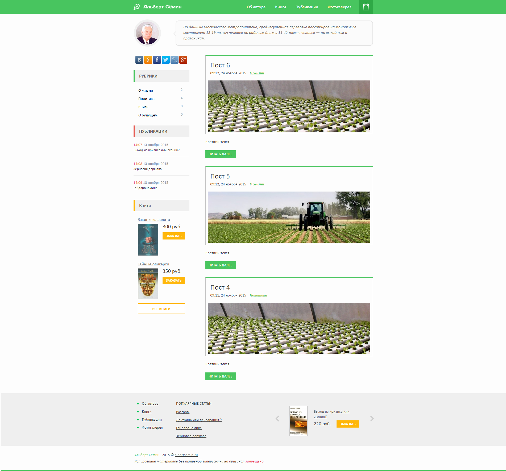
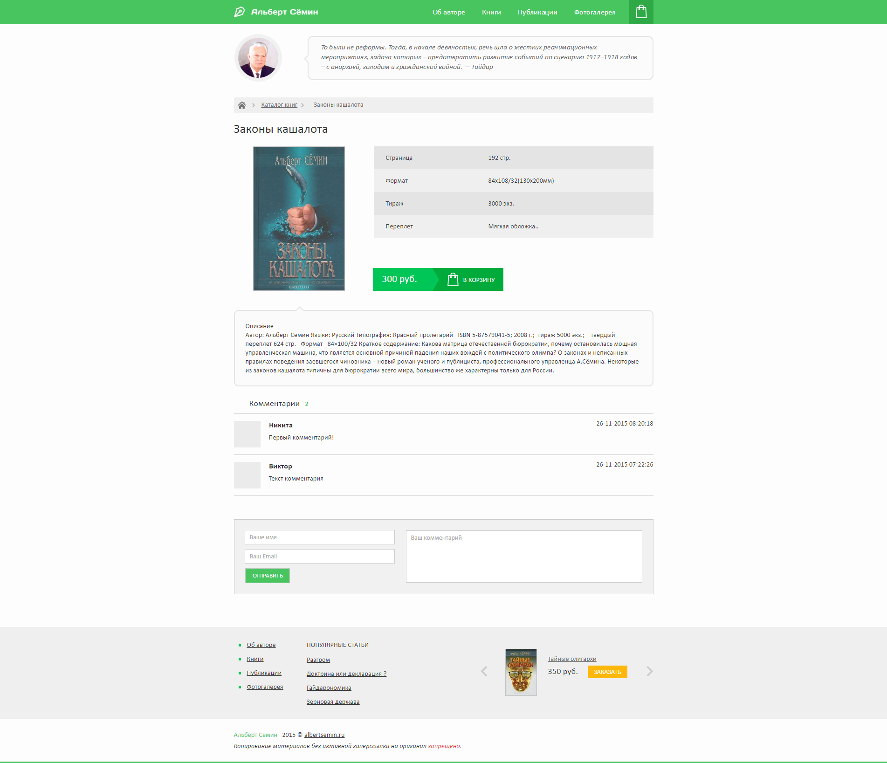

## Авторский блог Альберта Сёмина (2015)
Авторский блог Альберта Сёмина - советника по сельскому хозяйству председателя Совета Федерации РФ.

### Что сделано
Разработан блог с управлением постами, рубриками, фотогалереей, случайными цитатами. Также есть возможность заказа книг.

Для разработки дизайна был привлечён сторонний специалист.

### URL
Сайт прекратил работу. [https://albertsemin.ru](https://albertsemin.ru)

### Скриншоты

