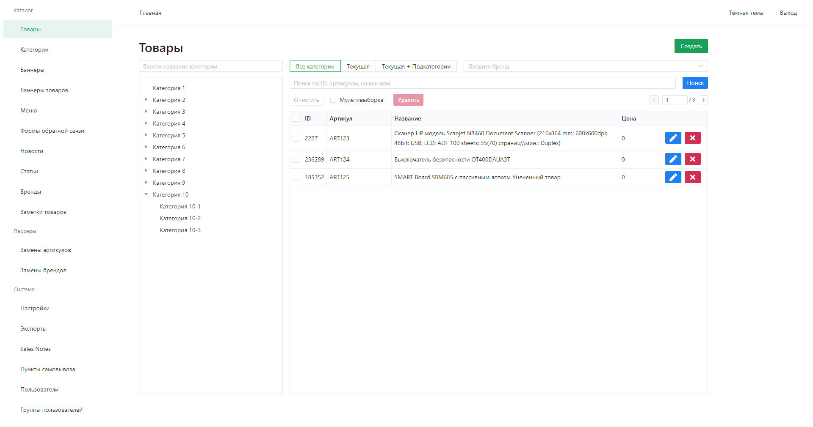
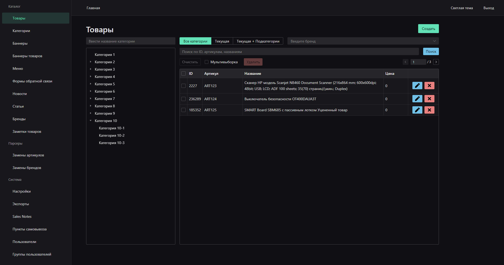
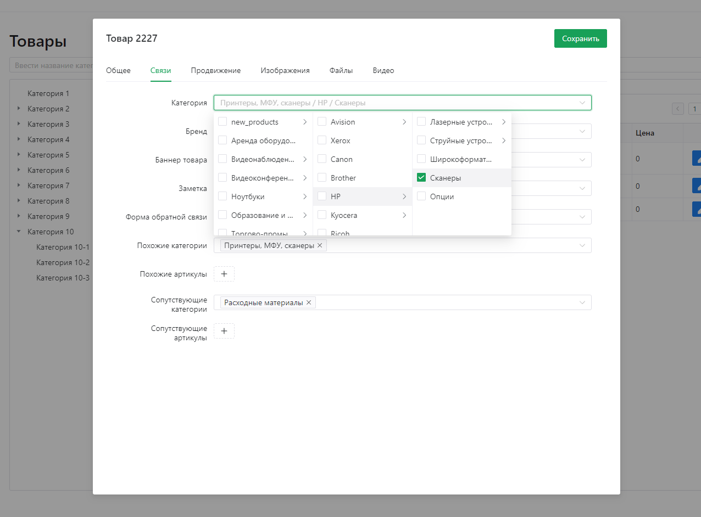
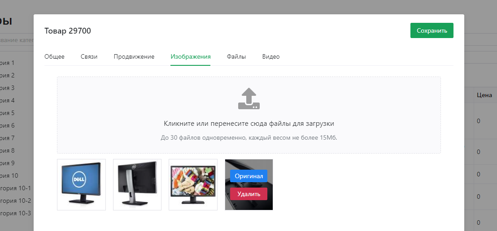
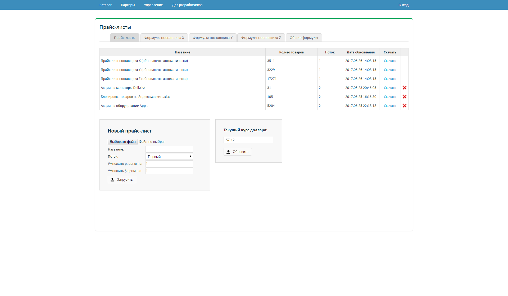
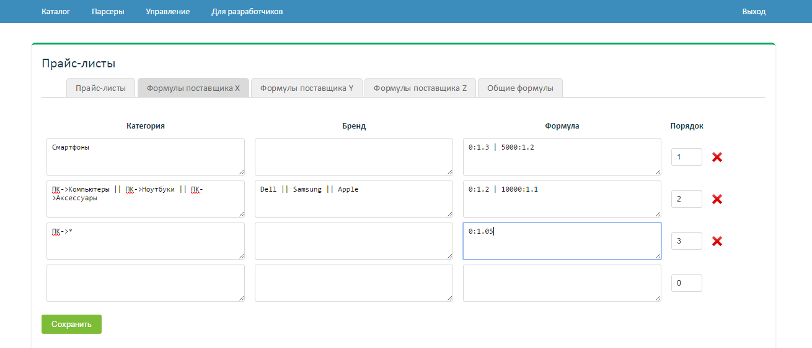
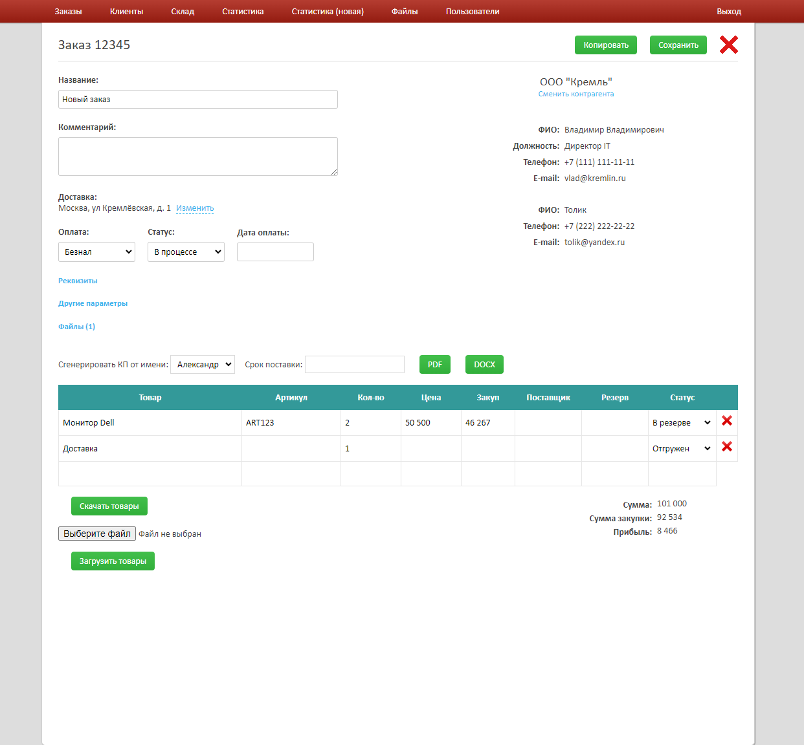
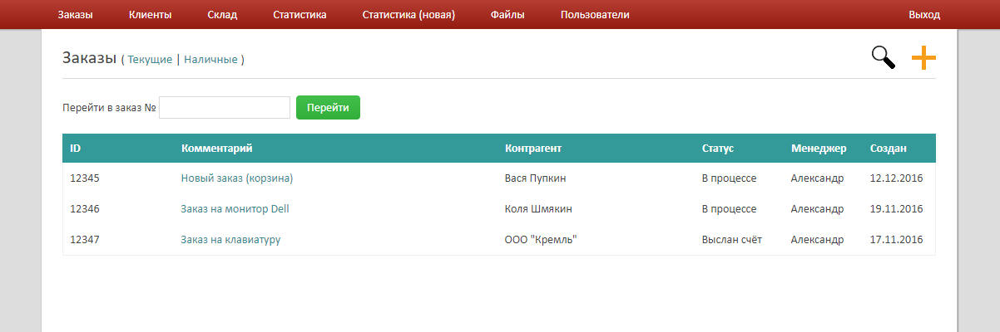
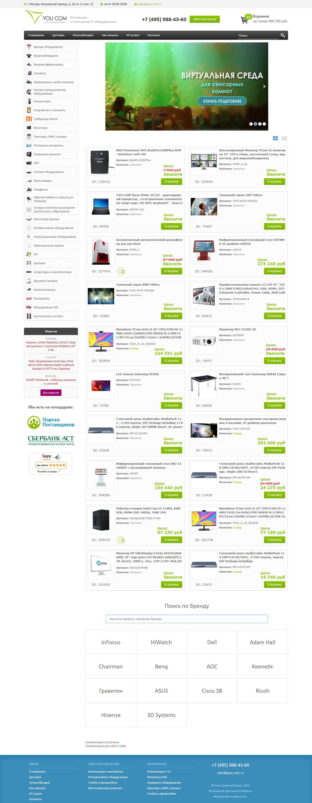

## Интернет-магазин YCom (2014 - настоящее время)
YCom - поставщик и интегратор IT оборудования.

Первые 2.5 года совмещал должности менеджера по продажам и веб-разработчика, затем перешёл на full-stack разработку.

### Что делал на работе
- Полностью отвечал за сайт и внутренние сервисы компании.
- Разработал и внедрил CRM, что серьёзно упростило работу с заказами и статистикой продаж.
- Произвёл рефакторинг 90% функционала сайта с переносом на Laravel 8.
- Произвёл интеграцию с B2B системами 7 поставщиков (парсинг прайс-листов + каталога товаров, с API и без, с чтением данных из HTML, XML, JSON, XLSX, CSV).
- Разработал сложную систему прайс-листов, что в разы упростило управление ценами и наличием товаров.
- Создал удобную SPA-админку на Nuxt 3 + Vue 3 + Naive UI + Laravel в качестве Backend API.
- Разработал систему экспорта товаров в маркетплейсы, что увеличило продажи компании.
- Обучал помощника основам веб-разработки.

Также было выполнено множество других работ (интеграция платёжной системы PayAnyWay, импорт/экспорт товаров через Excel, генерация коммерческих предложений в Word и PDF, поиск по характеристикам и т.д.).

### URL
[https://www.you-com.ru/](https://www.you-com.ru/)

### Скриншоты
Несколько скринов новой админки (Nuxt 3 + Vue 3 + Naive UI):

Пара скринов старой админки:

Пара скринов CRM:

Главная страница

